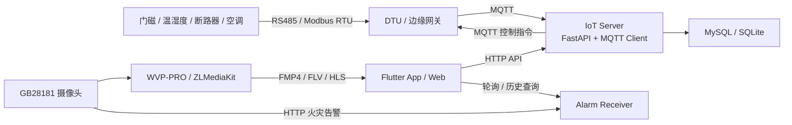

# IoT 设备间智能监控平台

一套面向配电间、机房等场景的物联网监控系统。项目基于 Flutter、FastAPI、MQTT 和 Modbus RTU，覆盖传感器数据采集、历史查询、远程控制、视频接入和火灾告警处理。

## 我的职责

- 负责 Flutter 客户端和 Python 后端核心模块开发与联调。
- 实现 Modbus RTU 帧解析、CRC16 校验和控制命令组帧。
- 对接 MQTT 数据链路、FastAPI 业务接口和 MySQL/SQLite 数据存储。
- 对接 WVP-PRO、ZLMediaKit 和 GB28181 视频链路。
- 接收摄像头侧 AI 火灾告警，完成告警留存、配对、查询与客户端提醒。

## 系统架构



详细说明见 [docs/ARCHITECTURE.md](docs/ARCHITECTURE.md)。

## 已实现功能

- 门磁状态监控、状态边沿检测、3 秒防抖和开关门历史。
- 温湿度实时查询、历史曲线、统计数据和一分钟采样落库。
- 智能断路器远程分合闸与操作记录。
- 空调开关、温度和模式控制。
- GB28181 视频点播、截图及录像回放接口接入。
- 火灾告警 HTTP 接收、抓拍留存、开始/恢复事件配对和本地通知。

## 技术栈

- 客户端：Flutter、Dart、Dio/HTTP、fl_chart、video_player、WebView
- 后端：Python、FastAPI、SQLAlchemy、asyncio
- 通信：MQTT、Modbus RTU、HTTP、GB28181
- 数据存储：MySQL，连接失败时可降级为 SQLite
- 视频平台：WVP-PRO、ZLMediaKit

## 关键实现

### 协议与数据处理

后端对 Modbus RTU 数据帧执行 CRC16 校验并按设备类型解析。门磁只在状态变化时记录事件，并加入 3 秒防抖；温湿度实时值保存在内存中，同时按一分钟间隔采样入库，降低重复数据量。

### 视频与告警

Flutter 客户端通过 WVP-PRO/ZLMediaKit 获取 FMP4、FLV、HLS 等播放地址。独立告警服务接收摄像头 HTTP 推送，保存告警元数据和抓拍图片，并将火灾开始与恢复事件配对后提供查询接口。

### 配置管理

项目使用环境变量管理不同部署环境的连接参数：

- 后端通过 `.env` 读取数据库、MQTT 和 ZLMediaKit 配置。
- Flutter 通过 `--dart-define` 注入 API、WVP、设备编号和认证配置。
- `.gitignore` 排除密码、数据库、日志、告警数据和构建产物。

`--dart-define` 适合进行客户端环境切换，但不应承载高权限凭据。生产环境应由后端代理需要鉴权的 WVP/ZLMediaKit 管理接口，避免将管理员凭据分发到客户端。

## 快速开始

### 1. 启动后端

```bash
cd iot-server
python -m venv .venv
# Windows: .venv\Scripts\activate
# macOS/Linux: source .venv/bin/activate
pip install -r requirements.txt
# Windows PowerShell: Copy-Item .env.example .env
# macOS/Linux: cp .env.example .env
python main.py
```

默认 API 地址为 `http://localhost:8900`，接口文档位于 `/docs`。MQTT Broker 与 MySQL 需要单独启动；MySQL 不可用时服务会尝试使用 SQLite。

火灾告警接收服务独立启动：

```bash
python alarm_receiver.py
```

### 2. 启动 Flutter

```bash
cd iotroom
flutter pub get
flutter run --dart-define=API_BASE_URL=http://localhost:8900 --dart-define=ALARM_BASE_URL=http://localhost:9090 --dart-define=WVP_HOST=localhost
```

Android 模拟器访问宿主机时，请将 `localhost` 改为 `10.0.2.2`。WVP/ZLMediaKit 和真实设备参数按需通过额外的 `--dart-define` 注入，完整变量见 [AppConfig](iotroom/lib/core/config/app_config.dart)。

## 测试

```bash
cd iot-server
python -m unittest discover -s tests -v

cd ../iotroom
flutter test
flutter analyze
```

## 功能说明

- 本项目不包含摄像头侧 AI 识别算法，只负责接收和处理摄像头产生的告警。
- WVP-PRO 与 ZLMediaKit 是第三方平台，本项目负责部署、配置与接口接入。
- 巡检页面和部分扩展入口仍使用演示数据，未作为完整业务能力对外声明。
- 当前工程保留 Android 与 Web 平台配置；iOS 尚未进行实机验证。
